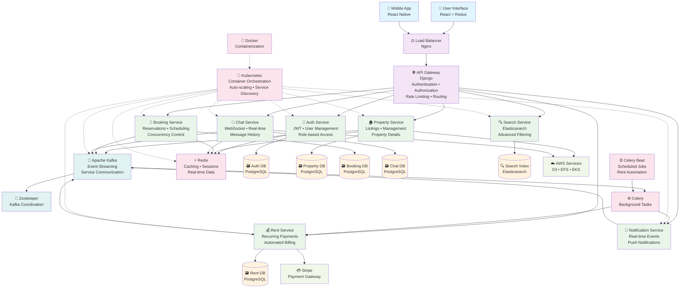
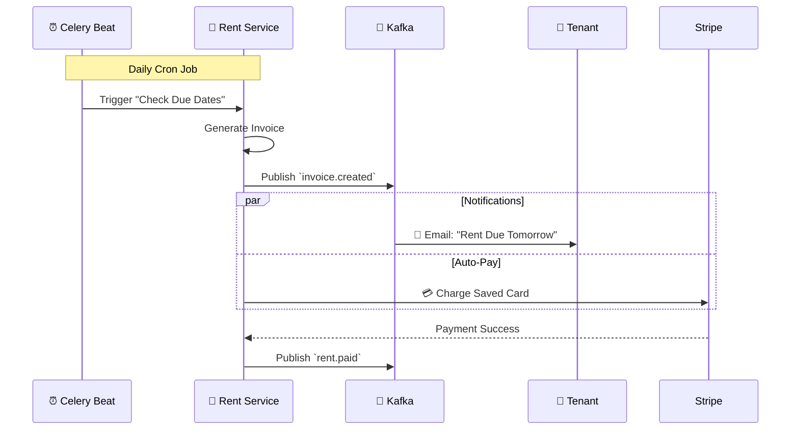
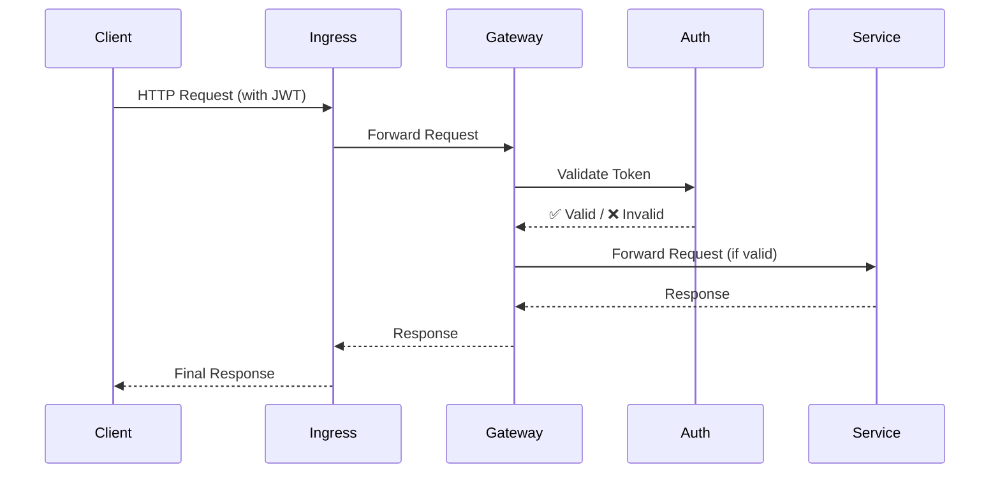

# 🏡 RentEzy - Distributed, Event-driven PropTech Platform

[](https://rentezy-frontend-g63i-git-main-adilabubackers-projects.vercel.app/)
[](https://microservices.io/)
[](https://kubernetes.io/)
[](https://kafka.apache.org/)
[](https://www.django-rest-framework.org/)

> *A fully distributed, event-driven, microservices-based platform automating entire property rental lifecycle from property discovery and visit scheduling to rent collection and communication.*


---

<div align="center">

• 🎪 [10+ Independent Microservices](#-10-independent-microservices) 
• 🔒 [Concurrency Control & Race Condition Prevention](#1️⃣-concurrency-control--race-condition-prevention)
<br/>
• 🧠 [Event-Driven Architecture & Kafka](#2️⃣-event-driven-architecture--the-nervous-system-of-rentezy) 
• 🔁 [Distributed Transactions & The Saga Pattern](#3️⃣-distributed-transactions--the-saga-pattern) 
• 🔍 [CQRS & Elasticsearch](#5️⃣-advanced-search-architicture-cqrs-in-action)
<br/>
• 💳 [Automated Recurring Rent Billing Engine](#4️⃣-automated-rent-payment-system--intelligent-billing-that-runs-itself) 
• 🛡️ [Zero Trust Architecture](#6️⃣-centralized-authentication-across-the-services) 
• 📦 [Kubernetes on AWS EKS](#-deployment-architecture)

</div>


---
<div align="center">
  
  <!-- <p><em>Intuitive location-based search powered by React + Django microservices</em></p> -->
</div>

---

## 🎯 The Challenge

Building a property rental platform is easy. Building one that **handles thousands of concurrent bookings without race conditions, processes payments automatically while you sleep, and scales infinitely** - that's the real challenge.

RentEzy isn’t a property management app — it’s a **distributed systems case study disguised as one**. Every architectural decision — from **Kafka-based communication** to **Celery-driven automation** — is designed for **fault tolerance**, **scalability**, and **resilience** at production scale.


---

## 🏗️ System Architecture Overview



---

### 🎪 10+ Independent Microservices

Each service is a self-contained, independently horizontally scalabe unit with its own database, business logic, and scaling policy:


| Service / Component | Role | Description & Key Features |
| --- | --- | --- |
| **`api_gateway`** | **Entry Point** | Centralized entry for all requests. Handles authentication routing, rate limiting, and security enforcement. |
| **`auth_service`** | **Identity** | Manages user registration, login, and JWT token issuance. Holds the secret keys for zero-trust security. |
| **`booking_service`** | **Core Business** | Handles property reservations and availability. Uses optimistic locking to prevent race conditions. |
| **`chat_service`** | **Communication** | Manages real-time WebSocket connections for messaging between tenants and landlords. |
| **`efs-role`** | **Infrastructure** | AWS IAM roles and policies required for mounting Elastic File System (EFS) volumes to Kubernetes pods. |
| **`elastic_search`** | **Search Engine** | Configuration and deployment manifests for the Elasticsearch cluster used for high-speed property querying. |
| **`kafka`** | **Event Bus** | Apache Kafka configuration. Acts as the central nervous system for async communication between services. |
| **`notification_service`** | **Alerts** | Listens for events (like "rent due") and sends emails, SMS, or push notifications to users. |
| **`property_service`** | **Core Business** | Manages property listings, details, image uploads, and landlord inventory. |
| **`redis`** | **Caching** | Redis deployment for session storage, caching frequently accessed data, and Celery task queues. |
| **`rent_service`** | **Finance** | automated billing engine. Handles recurring rent generation, late fees, and Stripe payment integration. |
| **`schedule_visit`** | **Scheduling** | A dedicated service for booking and managing physical property viewing appointments. |
| **`search_consumer`** | **Worker** | A background worker that listens to Kafka events to update the Elasticsearch index (CQRS implementation). |
| **`search_service`** | **Query API** | Read-only API that queries Elasticsearch. Separated from write logic for high performance. |
| **`storageclass`** | **Infrastructure** | Kubernetes StorageClass definitions for provisioning Persistent Volumes (PV) and Claims (PVC). |
| **`zookeeper`** | **Coordination** | Zookeeper manifests required to manage and coordinate the Apache Kafka cluster. |

| Service / Component | Purpose | Key Features |
| --- | --- | --- |
| **`api_gateway`** | Central Entry Point | Authentication, routing, rate limiting, SSL termination |
| **`auth_service`** | Identity Management | JWT issuance/validation, user registration, role-based access (RBAC) |
| **`booking_service`** | Reservation Core | Handle bookings, optimistic concurrency control, conflict detection |
| **`chat_service`** | Real-time Messaging | WebSocket connections (Django Channels), message persistence |
| **`efs-role`** | Storage Config | IAM roles and policies for AWS EFS (Elastic File System) access |
| **`elastic_search`** | Search Engine Cluster | Full-text search engine setup, index configuration, mappings |
| **`kafka`** | Event Streaming | Message broker configuration, topic management, producer/consumer rules |
| **`notification_service`** | Alerts & Comms | Multi-channel delivery (Email, Push, SMS) via event triggers |
| **`property_service`** | Inventory Management | Property CRUD, image handling, landlord listing management |
| **`redis`** | Caching & Queues | In-memory data store, session management, Celery task broker |
| **`rent_service`** | Billing Engine | Recurring payments, automated invoicing, late fee calculation |
| **`schedule_visit`** | Appointment System | Property tour scheduling, calendar slot management |
| **`search_consumer`** | Indexing Worker | Listens to Kafka events to update Elasticsearch asynchronously |
| **`search_service`** | Query API | Read-only API for fast property filtering and searching |
| **`storageclass`** | K8s Storage | Kubernetes Persistent Volume Claim (PVC) definitions |
| **`zookeeper`** | Cluster Coordination | Manages Kafka cluster state and distributed synchronization |


| Service | Purpose | Key Features |
|---------|---------|--------------|
| `api_gateway` | Entry point for all requests | Auth, routing, rate limiting |
| `auth_service` | Identity and access management | JWT tokens, role-based access |
| `property_service` | Property listings and details | CRUD operations, image uploads |
| `booking_service` | Reservation management | Concurrency control, conflict detection |
| `rent_service` | Rental agreements and payments | Recurring billing, late fees |
| `chat_service` | Real-time messaging | WebSocket connections, message persistence |
| `notification_service` | Event notifications | Email, SMS, push, WebSocket |
| `search_service` | Property search API | Filters, pagination, relevance ranking |
| `search_consumer` | Elasticsearch indexing | Event processing, bulk updates |
| `elastic_search` | Search cluster management | Index configuration, mappings |
| `schedule_visit` | Property viewing appointments | Calendar integration, reminders |
| `kafka` | Message broker setup | Topic management, configuration |
| `redis` | Caching and session store | Distributed locks, pub/sub |
| `storageclass` | Kubernetes storage | Persistent volume claims |
| `zookeeper/manifests` | Kafka coordination | Cluster management |

---

## 🚀 What Makes This Architecture Special


### 1️⃣ **Concurrency Control & Race Condition Prevention**
**The Problem:** Multiple users booking the same room simultaneously causes double-bookings and overselling  
**The Solution:** Optimistic concurrency control with database-level constraints and atomic operations


#### 🔴 **Why Traditional Locking Fails at Scale**
Traditional approaches use **pessimistic locking** (SELECT FOR UPDATE) which creates **lock contention** , forcing requests to wait in line, **degrading throughput** under high concurrency.


#### 💪 **Leveraging ACID Guarantees**
Instead of explicit locks, RentEzy pushes the logic down to the **Database Layer**, utilizing powerful **ACID guarantees** of PostgreSQL to handle concurrency without application-level bottlenecks.
```python

# Database Model with Constraint
class AvailableRooms(models.Model):
    initial_quantity = models.IntegerField(default=1)
    available_quantity = models.IntegerField()
    
    class Meta:
        constraints = [
            models.CheckConstraint(
                check=Q(available_quantity__gte=0),
                name="available_quantity_non_negative"
            )
        ]

# Booking Logic - Optimistic Concurrency Control
try:
    with transaction.atomic():
        # Create booking first
        booking = Booking.objects.create(room_id=room_id, tenant_id=tenant_id)
        
        # Atomic decrement - evaluated in database, not Python
        AvailableRooms.objects.filter(id=room_id).update(
            available_quantity=F("available_quantity") - 1
        )
        
except IntegrityError as e:
    if "available_quantity_non_negative" in str(e):
        return {"error": "Property is fully booked"}
    return {"error": "Booking failed"}
```

**How we are leveraging ACID:**

  * ✅ **Atomicity (A):** We wrap the "Booking Creation" and "Room Decrement" in a single transaction. Either both succeed, or both fail.
  * ✅ **Consistency (C):** We rely on **Database Constraints** (`CheckConstraint(qty >= 0)`). The database engine itself enforces the rule that inventory can *never* be negative, acting as the final guardrail against race conditions.
  * ✅ **Isolation (I):** Instead of locking rows in Python, we use a single atomic `UPDATE`. The database engine **serializes concurrent writes** internally for the microsecond it takes to execute the query, maximizing throughput.

**🤝 The Synergy:**  
**Isolation** serializes concurrent write requests. The first update after stock depletion violates the **Consistency** constraint, which instantly forces an **Atomic** rollback of the entire transaction, guaranteeing zero overselling.

#### 📊 Concurrency Performance: Theoretical Projection

**Scenario: 1000 users booking last 10 rooms simultaneously**

| Approach | Throughput | Latency (p99) | Overselling Risk |
|----------|-----------|---------------|------------------|
| Pessimistic Locking (`select_for_update`) | 50 req/sec | 2000ms | Zero |
| **Optimistic + Constraints (Our Approach)** | **800 req/sec** | **150ms** | **Zero** ✅ |
| No Concurrency Control | 1000 req/sec | 50ms | **HIGH** ❌ |

**Result: Performance of uncontrolled systems with the safety of pessimistic locking.**

---
### 2️⃣. Event-Driven Architecture — The Nervous System of RentEzy

**The Problem:**  Coordinating complex workflows across microservices without becoming a dependency nightmare.
**The Solution: Event-driven architecture with Apache Kafka as its central nervous system.**

Traditional synchronous REST calls between services lead to tight coupling, cascading failures, and deployment nightmares. In RentEzy services publish events to Kafka. Downstream consumers react to these events asynchronously, without the original service even knowing they exist.


**Why this architecture wins:**

🔌 **Zero Coupling**
Property Service doesn't know Search exists. A new "Analytics Service" can be added to listen for events with **zero changes** to existing services.

🛡️ **Fault Isolation** 
Search crashes? Bookings continue. Temporary service failures don't cascade. Kafka retains events, and the service catches up on restart. 

⚡ **Async Performance**  
API returns instantly. Heavy operations happen in background. No timeouts, no blocking.

📈 **Independent Scaling**  
Scale Notification to 10 pods while Property runs on 3. Kafka consumer groups handle distribution.
  
🔄 **Event Replay**  
Rebuild indices from scratch. Populate new services with historical data. Time-travel for debugging.

🎯 **Real-Time Experience**  
Notifications, search updates, and analytics all respond in near real time because they are event-driven, not batched.

**Result:**  Services can be scaled, deployed, and fail independently without affecting each other.

---
 
### 3️⃣ Distributed Transactions & The Saga Pattern

**The Problem:** Booking a property spans multiple components. How to do distributed transaction without two-phase commit or distributed locks.  
**The Solution: Choreography-based Saga pattern** with **Compensating Transactions** and semantic locking.

  
**🔴 Why we need Distributed ACID Semantics**  
  
We require ACID-like guarantees across this network boundary to prevent the "Dual Write" problem. Naive approaches fail because we cannot "Rollback" a Stripe charge with a SQL command:

* **Charge First, Book Later?** Risks charging the user when no rooms are left (high refund rate).
* **Book First, Charge Later?** Risks "ghost bookings" where users reserve rooms but never pay, blocking inventory.


#### 🎯 The Booking Saga Lifecycle

```text
HAPPY PATH (Success Saga):
┌─────────────────────────────────────────────────────┐
│ 1. Reserve Room (Local Transaction)                 │
│    - Decrement qty (F() expression)                 │
│    - Create Booking (status='pending')              │
│    - Schedule timeout (Celery delay 15min)          │
└─────────────────┬───────────────────────────────────┘
                  │
┌─────────────────▼───────────────────────────────────┐
│ 2. Initiate Stripe Payment                          │
│    - Create payment intent                          │
│    - Return to user for 3D Secure flow              │
└─────────────────┬───────────────────────────────────┘
                  │
┌─────────────────▼───────────────────────────────────┐
│ 3. Stripe Webhook: payment_intent.succeeded         │
│    - Update booking status='confirmed'              │
│    - Cancel pending Celery task (if not executed)   │
└─────────────────────────────────────────────────────┘

COMPENSATION FLOW 1 (Payment Failed):
┌─────────────────────────────────────────────────────┐
│ Stripe Webhook: payment_intent.failed               │
│ COMPENSATE:                                         │
│    - Increment qty back (F() + 1)                   │
│    - Update booking status='cancelled'              │
└─────────────────────────────────────────────────────┘

COMPENSATION FLOW 2 (Timeout - No Webhook):
┌─────────────────────────────────────────────────────┐
│ Celery Task Fires After 15min                       │
│ IF booking.status == 'pending':                     │
│ COMPENSATE:                                         │
│    - Increment qty back (F() + 1)                   │
│    - Update booking status='cancelled'              │
└─────────────────────────────────────────────────────┘

EDGE CASE FLOW (Late Webhook After Timeout):
┌─────────────────────────────────────────────────────┐
│ Stripe Webhook arrives AFTER timeout cancelled      │
│ IF booking.status == 'cancelled':                   │
│   TRY:                                              │
│     - Check if qty > 0                              │
│     - Create NEW booking if available               │
│   ELSE:                                             │
│     COMPENSATE:                                     │
│       - Refund via Stripe API                       │
│       - Notify user of cancellation                 │
└─────────────────────────────────────────────────────┘
```

**Why this flow is bulletproof:**

🎯 **Atomic Hold (Semantic Lock)**  
 We reserve inventory locally before payment. This creates a PENDING booking and decrements stock immediately, while arming a 15-minute background timer to auto-release the hold if payment fails.
 
⏱️ **The Deadman's Switch**  
The Celery delayed task acts as a time-to-live (TTL) on the reservation. If the payment webhook never arrives, the system automatically self-heals by running a **Compensation Transaction** to release the inventory.

💰 **Zombie Resurrection Protocol**  
If a successful payment arrives after the timer releases the room, the system attempts to "resurrect" the booking by re-acquiring stock. If the inventory was lost to another user in that window, we automatically trigger a Compensating Transaction (Refund) to maintain consistency.

💪 **Deterministic Concurrency**  
To handle race conditions between the "timeout" timer and late webhooks, we utilize select_for_update() row locks. This forces a serialized, conflict-free transition to either CONFIRMED or CANCELLED, preventing split-brain states.

---

### 4️⃣  **Automated Rent Payment System — Intelligent Billing That Runs Itself**
**The Problem:** Managing rent payments for hundreds of properties manually is inefficient and error-prone.  
**The Solution: Fully automated rent lifecycle engine**, powered by Celery Beat, Redis, Kafka, and Stripe.

**🧠 How It Works**




### **⚡ Key Capabilitiess**

- **🔄Cron-Driven Orchestration** – Celery Beat evaluates active leases daily to generate invoices, apply late fees, and trigger reminders.
- **💳Payment via Stripe** – Integrates with Stripe to securely charge saved payment methods off-session. 
- **⏰ Smart Reminders** – Proactive notifications of 3-day reminders, due-day notices, and overdue warnings.
- **📈 Dynamic Late Fees** – Celery monitors unpaid invoices and automatically applies late fees based on configurable grace periods.
- **Event-Driven Ledger** - Invoice creation, payment success, and failure triggers are decoupled via Kafka, allowing the Notification Service to react independently.
- **Idempotent & Resilient Tasks** – All Celery jobs and Kafka consumers are retry-safe; duplicate messages never cause double billing.  
- **Audit-Ready Data** – Complete rent history and payment lifecycle stored in RentDB and Kafka topics for compliance and reporting.  


**Result**: Landlords get paid automatically, tenants get reminded proactively

---

### 5️⃣ Advanced Search Architecture: CQRS in action
**The Problem:** PostgreSQL full-text search crumbles under complex filters and high query volume  
**The Solution: CQRS with Event-Driven Indexing and ElasticSearch**

To handle large-scale search queries efficiently, RentEzy separates the **Search Service** (query layer) from the **Search Consumer** (indexing layer).


- **Property Service (PostgreSQL)** handles CRUD for landlords — structured, low-frequency writes.
- **Kafka** acts as the async event bridge between the property DB and search index.
- **Search Consumer** listens to property events and updates **Elasticsearch**, ensuring eventual consistency.
- **Search Service** focuses solely on read queries, scaling horizontally to handle high traffic.

**This separation ensures**:
- ✅ Independent scaling for read-heavy and write-light workloads.
- ✅ Search uptime independent of data ingestion.
- ✅ Replayable Kafka streams for reindexing or schema migrations.

**Result:** Search that scales independently, fails gracefully.
  
---


 

### 6️⃣ Centralized Authentication Across the Services
**The Problem:** How do you secure 10+ microservices without duplicating auth logic everywhere?  
**The Solution: Zero-Trust Architecture with Centralized Auth**

The `Auth Service` is the *only* service that holds the JWT secret. The Gateway simply acts as a bouncer, delegating the validation check before routing the request to the correct internal service.

**Why This Architecture is Superior:**

🛡️ **Secret Isolation**  
The JWT secret key never leaves the Auth Service. The Gateway and all 10+ business services don't know it, drastically reducing the attack surface.

🔐 **Zero-Trust Network**  
Business services (like Booking or Property) don't write any auth code. They are "dumb" and simply trust that any request they receive from the Gateway is already authenticated.

📦 **Centralized Logic**  
All cross-cutting concerns (Authentication, Authorization, Rate Limiting) live in one place. Want to change the auth logic? You only edit one service.

🔄 **Developer Velocity**  
You can build 100 new microservices, and they are all instantly secured by default simply by being behind the gateway.

🚀 **Scalability**  
The `Auth Service` scales independently. If auth becomes a bottleneck, we scale *only* that service, not the entire gateway.

**Result:** Bulletproof security with zero auth code duplication across 10+ services

---


## 🛠️ Technology Stack

| Layer | Technologies |
|-------|-------------|
| **Backend** | Django REST Framework, Python 3.11+ |
| **Frontend** | React 18, Redux Toolkit, Tailwind CSS |
| **Message Broker** | Apache Kafka (event streaming) |
| **Search** | Elasticsearch 8.x |
| **Caching** | Redis 7.x |
| **Task Queue** | Celery + Celery Beat |
| **Real-time** | Django Channels, WebSockets |
| **Database** | PostgreSQL 15 (normalized schema) |
| **Payments** | Stripe API |
| **Containerization** | Docker, Docker Compose |
| **Orchestration** | Kubernetes (AWS EKS) |
| **Storage** | AWS EFS CSI (persistent volumes) |
| **CI/CD** | GitHub Actions |

---

## 🔐 Security Features

- **JWT Authentication** - Stateless token-based auth across services
- **Role-Based Access Control (RBAC)** - Fine-grained permissions for Tenants, Landlords and Admin
- **Rate Limiting** - Prevent abuse and DDoS attacks
- **Zero-Trust Architecture** - Centralized JWT validation with secret isolation across all microservices
- **HTTPS Everywhere** - TLS encryption in transit
- **SQL Injection Prevention** - Parameterized queries via ORM
- **CSRF Protection** - Django middleware for form security

---

## 📦 Deployment Architecture

### AWS EKS with Fargate - Serverless Kubernetes

```yaml
Production Stack:
├── 🚢 AWS EKS Cluster (Kubernetes 1.28)
│   ├── 15+ Container Deployments
│   └── Server-less computing with Fargate
│
├── 💾 Storage Layer
│   ├── AWS EFS (Shared file system for Kafka, Elasticsearch)
│   ├── Persistent Volume Claims (Database persistence)
│   └── StatefulSets (Kafka, Redis, Elasticsearch clusters)
│
├── 🔀 Load Balancing
│   ├── AWS Application Load Balancer (Layer 7)
│   ├── Ingress Controller (Kubernetes-native routing)
│   └── Nginx (Reverse proxy with connection pooling)
│
└── 🐳 Containerization
    ├── Docker (Multi-stage builds for optimization)
    ├── Helm Charts (Kafka, Elasticsearch, Redis)
    └── AWS ECR (Private container registry)
```

### Why Kubernetes + Fargate?

- ⚡ **Serverless:** No EC2 management, pay-per-pod pricing
- 🛡️ **Self-healing:** Automatic pod restarts on failure
- 📦 **Resource Isolation:** Each service gets dedicated resources
- 🚀 **Zero-downtime:** Rolling updates with health checks
- 💰 **Cost-efficient:** Only pay for running pods

---


## 💎 TL;DR: Why RentEzy Stands Out?

RentEzy bridges the gap between a modern user experience and enterprise-grade distributed engineering. Here is the complete breakdown of what makes the platform unique:


✅ **Bulletproof Concurrency** – Optimistic locking & DB constraints prevent race conditions    
✅ **Event-Driven Architecture** – Kafka decouples 10+ services for async communication  
✅ **Distributed Sagas** – Choreography Saga patterns handle transactions without global locks  
✅ **Scheduled Visit** – Dedicated scheduling system for seamless property tour appointments  
✅ **Real-Time Chat** – WebSocket-powered instant messaging between tenants and landlords  
✅ **Multi-Tenant System** – Distinct, secure interfaces and RBAC for Landlords, Tenants & Admins  
✅ **Zero-Trust Security** – Centralized JWT gateway isolated from business logic  
✅ **CQRS Search Engine** – High-speed Elasticsearch separated from write operations  
✅ **Automated Finance** – Self-driving engine for recurring rent, invoices & late fees  
✅ **Multi-Channel Notifications** – Real-time notifications via WebSockets, Email & Push  
✅ **API Gateway Pattern** - Centralized auth, routing, and rate limiting  
✅ **Cloud-Native** – Kubernetes (EKS) orchestration with auto-scaling & resilience  

---


## 🧠 Engineering Takeaway

RentEzy is an experiment in **systems thinking** — It embodies what happens when **backend design, distributed computing, and DevOps** meet in one unified project.  

Special thanks to the open-source community for the incredible tools that make projects like this possible.  

**This project is actively evolving**. If you’re interested in contributing, reviewing architecture decisions, or just want to talk, feel free to reach out or open a discussion. 

[](https://linkedin.com/in/adil-abubacker-a63598232/) 
[](https://github.com/AdilAbubacker)

---

<div align="center">

**Built with ❤️ and a lot of ☕ by [Adil Abubacker](https://github.com/AdilAbubacker)**


