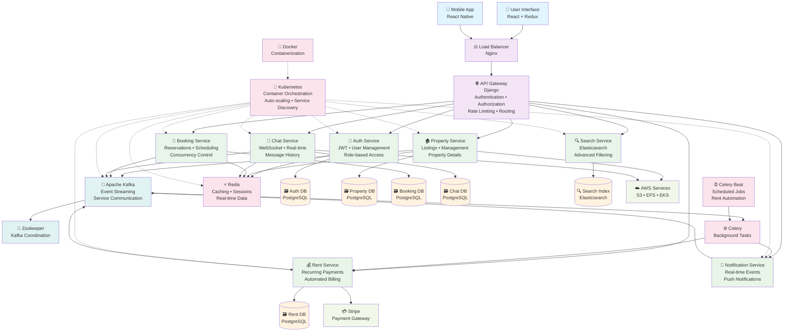
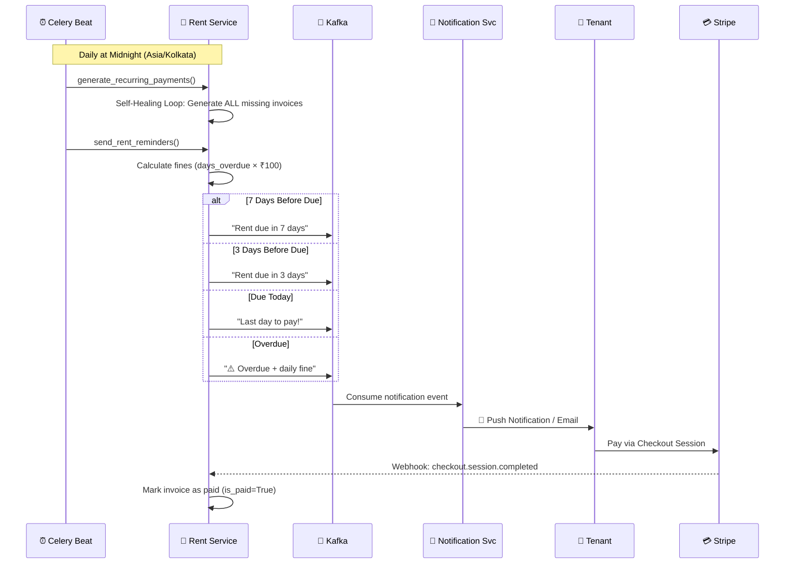
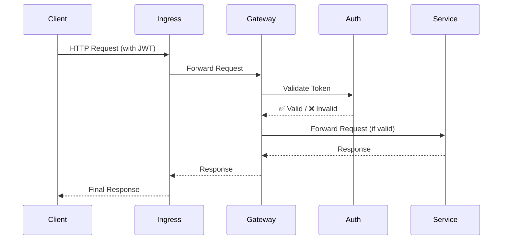

# 🏡 RentEzy - Enterprise-Grade PropTech Platform

[](https://www.rentezy.homes)
[](https://microservices.io/)
[](https://kubernetes.io/)
[](https://kafka.apache.org/)
[](https://www.django-rest-framework.org/)

> *A fully distributed, event-driven, microservices-based platform automating entire property rental lifecycle from property discovery and visit scheduling to rent collection and communication.*


---

<div align="center">

• 🎪 [10+ Independent Microservices](#-10-independent-microservices) 
• 🔒 [Concurrency Control & Race Condition Prevention](#1️⃣-concurrency-control--race-condition-prevention)
<br/>
• 🧠 [Event-Driven Architecture & Kafka](#2️⃣-event-driven-architecture--the-nervous-system-of-rentezy) 
• 🔁 [Distributed Transactions & The Saga Pattern](#3️⃣-distributed-transactions--the-saga-pattern) 
• 🔍 [CQRS & Elasticsearch](#5️⃣-advanced-search-architecture-cqrs-in-action)
<br/>
• 💳 [Automated Recurring Rent Billing with Celery](#4️⃣-automated-rent-payment-system--intelligent-billing-that-runs-itself) 
• 🛡️ [Zero Trust Architecture](#6️⃣-centralized-authentication-across-the-services) 
• 📦 [Kubernetes on AWS EKS](#-deployment-architecture)

</div>


---
<div align="center">
  
  <!-- <p><em>Intuitive location-based search powered by React + Django microservices</em></p> -->
</div>

---

## 🎯 The Challenge

Building a property rental platform is easy. Building one that **handles thousands of concurrent bookings without race conditions, processes payments automatically while you sleep, and scales infinitely** - that's the real challenge.

RentEzy isn’t a property management app — it’s a **distributed systems case study disguised as one**. Every architectural decision — from **Kafka-based communication** to **Celery-driven automation** — is designed for **fault tolerance**, **scalability**, and **resilience** at production scale.


---

## 🏗️ System Architecture Overview



---

### 🎪 10+ Independent Microservices

Each service is a self-contained, independently horizontally scalable unit with its own database, business logic, and scaling policy:

| Service / Component | Role | Description & Key Features |
| --- | --- | --- |
| **`api_gateway`** | **Entry Point & Security** | Centralized entry point handling authentication, routing, rate limiting, and security enforcement for all services. |
| **`auth_service`** | **Identity Management** | Manages user registration, login, and JWT token issuance. Holds the secret keys for zero-trust security. |
| **`property_service`** | **Catalog Management** | Manages property listings, details, image uploads, and landlord inventory management. |
| **`booking_service`** | **Reservations & Concurrency** | Handles property reservations and availability using optimistic locking to prevent race conditions. |
| **`rent_service`** | **Billing & Financials** | Automated billing engine. Handles recurring rent generation, late fees, and Stripe payment integration. |
| **`chat_service`** | **Real-time Communication** | Manages real-time WebSocket connections for instant messaging between tenants and landlords. |
| **`notification_service`** | **Alert Dispatching** | Listens for system events (like "rent due") and sends emails, SMS, or push notifications to users. |
| **`search_service`** | **Query & Discovery** | Read-only API that queries Elasticsearch. Separated from write logic for high-performance searching. |
| **`schedule_visit`** | **Appointment Management** | A dedicated service for coordinating physical property viewing appointments. |
| **`search_consumer`** | **Data Ingestion** | Background worker that listens to Kafka events to update the Elasticsearch index (CQRS implementation). |
| **`kafka`** | **Event Backbone** | Apache Kafka configuration acting as the central nervous system for async communication. |
| **`redis`** | **Caching Layer** | Redis deployment for session storage, caching frequently accessed data, and Celery task queues. |
| **`elastic_search`** | **Search Engine** | Configuration and deployment manifests for the Elasticsearch cluster used for high-speed querying. |
| **`zookeeper`** | **Cluster Coordination** | Zookeeper manifests required to manage and coordinate the Apache Kafka cluster. |
| **`efs-role`** | **AWS Storage Permissions** | AWS IAM roles and policies required for mounting Elastic File System (EFS) volumes to pods. |
| **`storageclass`** | **Kubernetes Persistence** | Kubernetes StorageClass definitions for provisioning Persistent Volumes (PV) and Claims (PVC). |
---

## 🚀 What Makes This Architecture Special


### 1️⃣ **Concurrency Control & Race Condition Prevention**
**The Problem:** Multiple users booking the same room simultaneously causes double-bookings and overselling  
**The Solution:** Optimistic concurrency control with database-level constraints and atomic operations


#### 🔴 **Why Traditional Locking Fails at Scale**
Traditional approaches use **pessimistic locking** (SELECT FOR UPDATE) which creates **lock contention** , forcing requests to wait in line, **degrading throughput** under high concurrency.


#### 💪 **Leveraging ACID Guarantees**
Instead of explicit locks, RentEzy pushes the logic down to the **Database Layer**, utilizing powerful **ACID guarantees** of PostgreSQL to handle concurrency without application-level bottlenecks.
```python

# Database Model with Constraint
class AvailableRooms(models.Model):
    initial_quantity = models.IntegerField(default=1)
    available_quantity = models.IntegerField()
    
    class Meta:
        constraints = [
            models.CheckConstraint(
                check=Q(available_quantity__gte=0),
                name="available_quantity_non_negative"
            )
        ]

# Booking Logic - Optimistic Concurrency Control
try:
    with transaction.atomic():
        # Create booking first
        booking = Booking.objects.create(room_id=room_id, tenant_id=tenant_id)
        
        # Atomic decrement - evaluated in database, not Python
        AvailableRooms.objects.filter(id=room_id).update(
            available_quantity=F("available_quantity") - 1
        )
        
except IntegrityError as e:
    if "available_quantity_non_negative" in str(e):
        return {"error": "Property is fully booked"}
    return {"error": "Booking failed"}
```

**How we are leveraging ACID:**

  * ✅ **Atomicity (A):** We wrap the "Booking Creation" and "Room Decrement" in a single transaction. Either both succeed, or both fail.
  * ✅ **Consistency (C):** We rely on **Database Constraints** (`CheckConstraint(qty >= 0)`). The database engine itself enforces the rule that inventory can *never* be negative, acting as the final guardrail against race conditions.
  * ✅ **Isolation (I):** Instead of locking rows in Python, we use a single atomic `UPDATE`. The database engine **serializes concurrent writes** internally for the microsecond it takes to execute the query, maximizing throughput.

**🤝 The Synergy:**  
**Isolation** serializes concurrent write requests. The first update after stock depletion violates the **Consistency** constraint, which instantly forces an **Atomic** rollback of the entire transaction, guaranteeing zero overselling.

#### 📊 Concurrency Performance: Theoretical Projection

**Scenario: 1000 users booking last 10 rooms simultaneously**

| Approach | Throughput | Latency (p99) | Overselling Risk |
|----------|-----------|---------------|------------------|
| Pessimistic Locking (`select_for_update`) | 50 req/sec | 2000ms | Zero |
| **Optimistic + Constraints (Our Approach)** | **800 req/sec** | **150ms** | **Zero** ✅ |
| No Concurrency Control | 1000 req/sec | 50ms | **HIGH** ❌ |

**Result: Performance of uncontrolled systems with the safety of pessimistic locking.**

---
### 2️⃣. Event-Driven Architecture — The Nervous System of RentEzy

**The Problem:**  Coordinating complex workflows across microservices without becoming a dependency nightmare.  
**The Solution: Event-driven architecture with Apache Kafka as its central nervous system.**

Traditional synchronous REST calls between services lead to tight coupling, cascading failures, and deployment nightmares. In RentEzy services publish events to Kafka. Downstream consumers react to these events asynchronously, without the original service even knowing they exist.


**Why this architecture wins:**

🔌 **Zero Coupling**  
Property Service doesn't know Search exists. A new "Analytics Service" can be added to listen for events with **zero changes** to existing services.

🛡️ **Fault Isolation**  
Search crashes? Bookings continue. Temporary service failures don't cascade. Kafka retains events, and the service catches up on restart. 

⚡ **Async Performance**  
API returns instantly. Heavy operations happen in background. No timeouts, no blocking.

📈 **Independent Scaling**  
Scale Notification to 10 pods while Property runs on 3. Kafka consumer groups handle distribution.
  
🔄 **Event Replay**  
Rebuild indices from scratch. Populate new services with historical data. Time-travel for debugging.

🎯 **Real-Time Experience**  
Notifications, search updates, and analytics all respond in near real time because they are event-driven, not batched.

**Result:**  Services can be scaled, deployed, and fail independently without affecting each other.

---
 
### 3️⃣ Distributed Transactions & The Saga Pattern

**The Problem:** Booking a property spans multiple services and a third-party payment gateway. How do we achieve distributed transaction guarantees without two-phase commit or distributed locks?  
**The Solution: Choreography-based Saga pattern** with **Compensating Transactions**, semantic locking, and multi-layer idempotency.

  
**🔴 Why We Need Distributed ACID Semantics**  
  
We require ACID-like guarantees across network boundaries to prevent the "Dual Write" problem. Naive approaches fail because we cannot "Rollback" a Stripe charge with a SQL command:

* **Charge First, Book Later?** Risks charging the user when no rooms are left (high refund rate).
* **Book First, Charge Later?** Risks "ghost bookings" where users reserve rooms but never pay, blocking inventory.


#### 🎯 The Booking Saga Lifecycle

```text
HAPPY PATH (Success Saga):
┌─────────────────────────────────────────────────────┐
│ 1. Reserve Room (Local Transaction)                 │
│    - Decrement qty (F() expression)                 │
│    - Create Booking (status='reserved')             │
│    - Schedule timeout (Celery delay 10min)          │
└─────────────────┬───────────────────────────────────┘
                  │
┌─────────────────▼───────────────────────────────────┐
│ 2. Initiate Stripe Payment                          │
│    - Create checkout session with idempotency_key   │
│    - Return checkout URL to user                    │
└─────────────────┬───────────────────────────────────┘
                  │
┌─────────────────▼───────────────────────────────────┐
│ 3. Stripe Webhook: checkout.session.completed       │
│    - Update booking status='booked'                 │
│    - Revoke pending Celery timeout task             │
└─────────────────────────────────────────────────────┘

COMPENSATION FLOW 1 (Payment Expired/Failed):
┌─────────────────────────────────────────────────────┐
│ Stripe Webhook: checkout.session.expired            │
│ COMPENSATE:                                         │
│    - Increment qty back (F() + 1)                   │
│    - Update booking status='cancelled'              │
└─────────────────────────────────────────────────────┘

COMPENSATION FLOW 2 (Timeout - No Webhook):
┌─────────────────────────────────────────────────────┐
│ Celery Task Fires After 10min                       │
│ IF booking.status == 'reserved':                    │
│ COMPENSATE:                                         │
│    - Increment qty back (F() + 1)                   │
│    - Update booking status='cancelled'              │
│    - Retry with exponential backoff on failure      │
└─────────────────────────────────────────────────────┘

EDGE CASE FLOW (Late Webhook After Timeout):
┌─────────────────────────────────────────────────────┐
│ Stripe Webhook arrives AFTER timeout cancelled      │
│ IF booking.status == 'cancelled':                   │
│   TRY:                                              │
│     - Re-acquire room via atomic F() decrement      │
│     - Resurrect booking if rooms available          │
│   ELSE:                                             │
│     COMPENSATE:                                     │
│       - Automatic refund via Stripe API             │
│       - User notified of cancellation               │
└─────────────────────────────────────────────────────┘
```

**Why this flow is bulletproof:**

🎯 **Atomic Hold (Semantic Lock)**  
We reserve inventory locally *before* payment. This creates a RESERVED booking and decrements stock immediately using Django's `F()` expressions, while arming a background timer to auto-release the hold if payment fails.

💰 **Late Payment Recovery**  
If a successful payment webhook arrives *after* the timeout cancelled the booking, the system attempts to restore the reservation by re-acquiring stock via atomic `F()` decrement. If inventory was claimed by another user, we trigger an automatic Stripe refund — maintaining consistency without manual intervention.

💪 **Deterministic Concurrency Control**  
To prevent race conditions between timeout tasks and late webhooks, we use `select_for_update()` row locks on the booking record. This serializes concurrent state transitions, ensuring the booking moves to exactly one final state (BOOKED or CANCELLED) — never both.

⏱️ **4-Layer Idempotency Defense**  
We enforce "Exactly-Once" processing semantics through multiple layers:  
1. **Client**: UUID-based `idempotency_key` prevents rage-click duplication.
2. **Database**: Unique constraint on booking key prevents parallel request duplication.
3. **Stripe**: Operation-scoped `idempotency_key` passed to Stripe API prevents duplicate payment charges.
4. **Webhook**: `stripe_charge_id` tracking prevents double-processing of events.
5. **Timer**: Status check before compensation prevents double room release.


**Result**: Guaranteed distributed data consistency without the performance bottleneck of global locks.

---

### 4️⃣  **Automated Rent Payment System — Intelligent Billing That Runs Itself**
**The Problem:** Managing rent payments for hundreds of properties manually is inefficient and error-prone. 
**The Solution: A self-healing, fully automated rent lifecycle engine** powered by Celery Beat, Kafka, and Stripe.

#### 🎯 The Rent Lifecycle Flow



**Why this architecture wins:**

🔄 **Self-Healing Scheduler**  
Scheduler down for a month? No problem. The `while` loop generates ALL missed invoices on the next run. Combined with `get_or_create`, duplicates are impossible.

📊 **Idempotent Fine Calculation**  
Fines are calculated as `days_overdue × fine_amount`, not accumulated. Run the task 100 times — the fine is always correct. No accumulation bugs, no audit nightmares.  

⏰ **Tiered Reminder System**  
Proactive notifications at 7 days, 3 days, due day, and overdue. Tenants are never surprised by a missed payment.

💳 **Stripe Checkout Integration**  
Secure hosted checkout with webhook confirmation. PCI-compliant without storing card data. Payment status updated atomically via `checkout.session.completed`.

📨 **Event-Driven Notifications**  
Kafka decouples billing from notification delivery. Notification Service can crash and recover without affecting rent generation. Events are replayed on restart.

🔒 **Database-Level Idempotency**  
`unique_together = ['rental_agreement', 'due_date']` constraint ensures no duplicate invoices, even under concurrent task execution.

**Result:** Landlords get paid automatically, tenants get reminded proactively, and the system self-heals from any scheduler failures.

---

### 5️⃣ Advanced Search Architecture: CQRS in action
**The Problem:** PostgreSQL ILIKE queries are slow at scale and fail when users make typos (e.g., searching "bnglr" instead of "Bangalore").
**The Solution: CQRS with Elasticsearch & Fuzzy Logic**

To handle large-scale search queries efficiently, RentEzy separates the **Search Service** (query layer) from the **Search Consumer** (indexing layer). And we utilize Elasticsearch's Fuzzy Query logic (Levenshtein edit distance) to handle user error and natural language


- **Property Service (PostgreSQL)** handles CRUD for landlords — structured, low-frequency writes.
- **Kafka** acts as the async event bridge between the property DB and search index.
- **Search Consumer** listens to property events and updates **Elasticsearch**, ensuring eventual consistency.
- **Search Service** focuses solely on read queries, scaling horizontally to handle high traffic.

**This separation ensures**:
- ✅ Independent scaling for read-heavy and write-light workloads.
- ✅ Search uptime independent of data ingestion.
- ✅ Typo Tolerance: A search for "2bhk in kormangla" successfully finds properties in "Koramangala".
- ✅ Replayable Kafka streams for reindexing or schema migrations.

**Result:** Typo-tolerant queries execute instantly without slowing down the primary transactional database.
  
---


 

### 6️⃣ Centralized Authentication Across the Services
**The Problem:** How do you secure 10+ microservices without duplicating auth logic everywhere?  
**The Solution: Zero-Trust Architecture with Centralized Auth**

The `Auth Service` is the *only* service that holds the JWT secret. The Gateway simply acts as a bouncer, delegating the validation check before routing the request to the correct internal service.

**Why This Architecture is Superior:**

🛡️ **Secret Isolation**  
The JWT secret key never leaves the Auth Service. The Gateway and all 10+ business services don't know it, drastically reducing the attack surface.

🔐 **Zero-Trust Network**  
Business services (like Booking or Property) don't write any auth code. They are "dumb" and simply trust that any request they receive from the Gateway is already authenticated.

📦 **Centralized Logic**  
All cross-cutting concerns (Authentication, Authorization, Rate Limiting) live in one place. Want to change the auth logic? You only edit one service.

🔄 **Developer Velocity**  
You can build 100 new microservices, and they are all instantly secured by default simply by being behind the gateway.

🚀 **Scalability**  
The `Auth Service` scales independently. If auth becomes a bottleneck, we scale *only* that service, not the entire gateway.

**Result:** Bulletproof security with zero auth code duplication across 10+ services

---


## 🛠️ Technology Stack

| Layer | Technologies |
|-------|-------------|
| **Backend** | Django REST Framework, Python 3.11+ |
| **Frontend** | React 18, Redux Toolkit, Tailwind CSS |
| **Message Broker** | Apache Kafka (event streaming) |
| **Search** | Elasticsearch 8.x |
| **Caching** | Redis 7.x |
| **Task Queue** | Celery + Celery Beat |
| **Real-time** | Django Channels, WebSockets |
| **Database** | PostgreSQL 15 (normalized schema) |
| **Payments** | Stripe API |
| **Containerization** | Docker, Docker Compose |
| **Orchestration** | Kubernetes (AWS EKS) |
| **Storage** | AWS EFS CSI (persistent volumes) |
| **CI/CD** | GitHub Actions |

---

## 🔐 Security Features

- **JWT Authentication** - Stateless token-based auth across services
- **Role-Based Access Control (RBAC)** - Fine-grained permissions for Tenants, Landlords and Admin
- **Rate Limiting** - Prevent abuse and DDoS attacks
- **Zero-Trust Architecture** - Centralized JWT validation with secret isolation across all microservices
- **HTTPS Everywhere** - TLS encryption in transit
- **SQL Injection Prevention** - Parameterized queries via ORM
- **CSRF Protection** - Django middleware for form security

---

## 📦 Deployment Architecture

### AWS EKS with Fargate - Serverless Kubernetes

```yaml
Production Stack:
├── 🚢 AWS EKS Cluster (Kubernetes 1.28)
│   ├── 15+ Container Deployments
|   ├── Self-managed Kubernetes cluster
│   └── Server-less computing with Fargate
│
├── 💾 Storage Layer
│   ├── AWS EFS (Shared file system for Kafka, Elasticsearch)
│   ├── Persistent Volume Claims (Database persistence)
│   └── StatefulSets (Kafka, Redis, Elasticsearch clusters)
│
├── 🔀 Load Balancing
│   ├── AWS Application Load Balancer (Layer 7)
│   ├── Ingress Controller (Kubernetes-native routing)
│   └── Nginx (Reverse proxy with connection pooling)
│
└── 🐳 Containerization
    ├── Docker (Multi-stage builds for optimization)
    ├── Helm Charts (Kafka, Elasticsearch, Redis)
    └── AWS ECR (Private container registry)
```

### Why Kubernetes + Fargate?

- ⚡ **Serverless:** No EC2 management, pay-per-pod pricing
- 🛡️ **Self-healing:** Automatic pod restarts on failure
- 📦 **Resource Isolation:** Each service gets dedicated resources
- 🚀 **Zero-downtime:** Rolling updates with health checks
- 💰 **Cost-efficient:** Only pay for running pods

---


## 💎 TL;DR: Why RentEzy Stands Out?

RentEzy combines enterprise-grade distributed engineering with deliberate attention to business logic and user experience, proving that system complexity doesn’t have to leak into the product.

✅ **Zero Overselling**– ACID-guaranteed inventory management via Optimistic Concurrency.  
✅ **Event-Driven Architecture** – Kafka decouples 10+ services for async communication  
✅ **Distributed Sagas** – Choreography Saga patterns handle transactions without global locks  
✅ **Exactly-Once Semantics** – Multi-layer idempotency across APIs, DBs, Stripe, webhooks, and schedulers  
✅ **Self-Healing Automation** – Celery-driven schedulers recover automatically after downtime without manual fixes  
✅ **Scheduled Visit** – Dedicated scheduling system for seamless property tour appointments  
✅ **Real-Time Chat** – WebSocket-powered instant messaging between tenants and landlords  
✅ **Multi-Tenant System** – Distinct, secure interfaces and RBAC for Landlords, Tenants & Admins  
✅ **Zero-Trust Security** – Centralized JWT gateway isolated from business logic  
✅ **Typo-Tolerant Search** – CQRS & Fuzzy matching handles user errors and millions of records.  
✅ **Automated Finance** – Self-driving engine for recurring rent, invoices & late fees  
✅ **Multi-Channel Notifications** – Real-time notifications via WebSockets, Email & Push  
✅ **API Gateway Pattern** - Centralized auth, routing, and rate limiting  
✅ **Cloud-Native** – Kubernetes (EKS) orchestration with auto-scaling & resilience  

---


## 🧠 Engineering Takeaway

RentEzy is an experiment in **systems thinking** — It embodies what happens when **backend design, distributed computing, and DevOps** meet in one unified project.  

Special thanks to the open-source community for the incredible tools that make projects like this possible.  

**This project is actively evolving**. If you’re interested in contributing, reviewing architecture decisions, or just want to talk, feel free to reach out or open a discussion. 

[](https://linkedin.com/in/adil-abubacker-a63598232/) 
[](https://github.com/AdilAbubacker)  
<sub><em>**⭐ Found this interesting? A star helps a lot!**</em></sub>

---

<div align="center">

**Built with ❤️ and a lot of ☕ by [Adil Abubacker](https://github.com/AdilAbubacker)**


