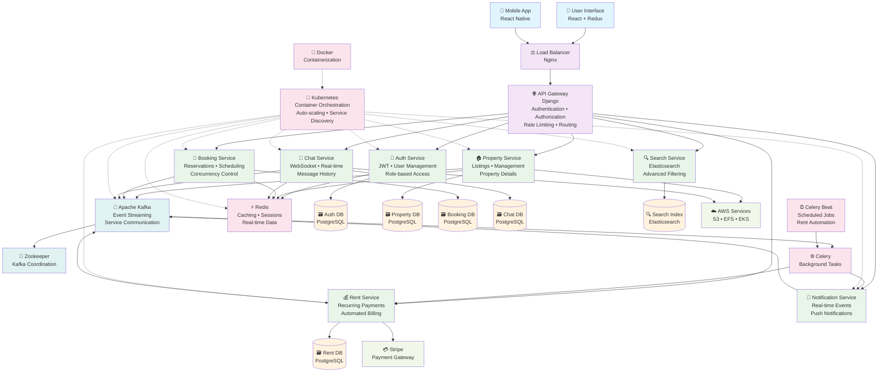
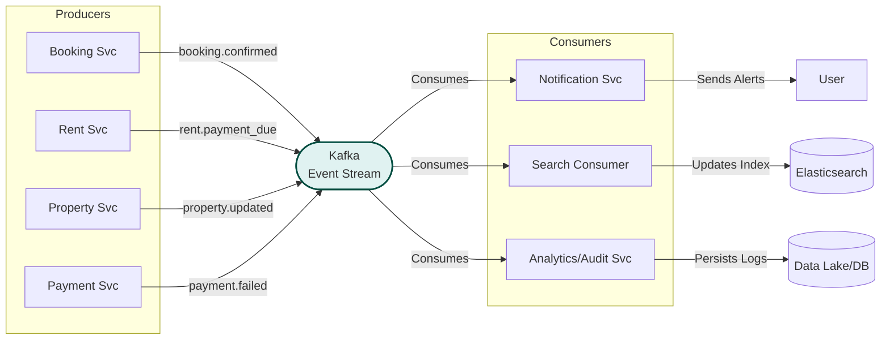
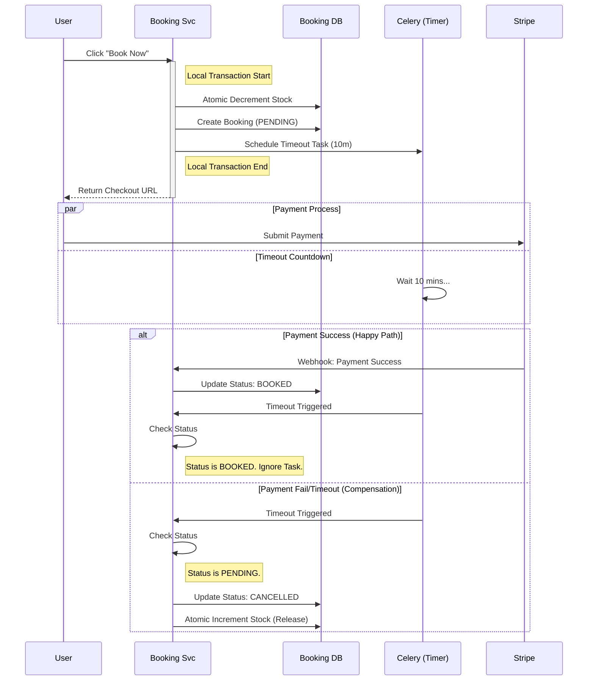
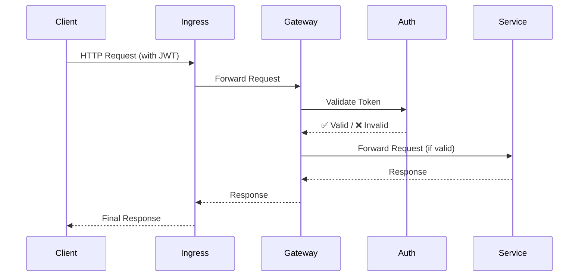

# 🏡 RentEzy - Distributed, Event-Driven PropTech Platform

[](https://rentezy-frontend-g63i-git-main-adilabubackers-projects.vercel.app/)
[](https://microservices.io/)
[](https://kubernetes.io/)
[](https://kafka.apache.org/)
[](https://www.django-rest-framework.org/)

> *A fully distributed, event-driven, microservices-based platform automating entire property rental lifecycle from property discovery and visit scheduling to rent collection and communication.*

<div align="center">


<div align="center">

---
<div align="center">
<div align="center">

### 📑 Table of Contents

🎪 [10+ Independent Microservices](#-10-independent-microservices) • 
🔒 [Concurrency Control & Race Condition Prevention](#1️⃣-concurrency-control--race-condition-prevention) 
<br/>
🧠 [Event-Driven Architecture — The Nervous System](#2️⃣-event-driven-architecture--the-nervous-system-of-rentezy) •
🔁 [Distributed Transactions & The Saga Pattern](#3️⃣-distributed-transactions--the-saga-pattern)
<br/>
💳 [Automated Rent Payment System — Intelligent Billing That Runs Itself](#4️⃣-automated-rent-payment-system--intelligent-billing-that-runs-itself) 
<br/>
🔍 [Advanced Search Architicture: CQRS in action](#5️⃣-advanced-search-architicture-cqrs-in-action) •
🛡️ [Zero Trust Architecture](#6️⃣-centralized-authentication-across-the-services)
<br/>
🛠️ [Technology Stack](#️-technology-stack) •
🔐 [Security Features](#-security-features) •
📦 [Deployment Architecture](#-deployment-architecture)
<br/>
⚡ [TL;DR: Why RentEzy Stands Out?](#-tldr-why-rentezy-stands-out) •
🧠 [Engineering Takeaway](#-engineering-takeaway)
</div>

---
<div align="center">
  
  <!-- <p><em>Intuitive location-based search powered by React + Django microservices</em></p> -->
</div>

---

## 🎯 The Challenge

Building a property rental platform is easy. Building one that **handles thousands of concurrent bookings without race conditions, processes payments automatically while you sleep, and scales infinitely** - that's the real challenge.

RentEzy isn’t a property management app — it’s a **distributed systems case study disguised as one**. Every architectural decision — from **Kafka-based communication** to **Celery-driven automation** — is designed for **fault tolerance**, **scalability**, and **resilience** at production scale.


---

## 🏗️ System Architecture Overview



---

### 🎪 10+ Independent Microservices

Each service is a self-contained, independently horizontally scalabe unit with its own database, business logic, and scaling policy:

| Service | Purpose | Why It Exists |
|---------|---------|---------------|
| 🚪 **API Gateway** | Authentication, routing, rate limiting | Single entry point, security enforcement |
| 🔐 **Auth Service** | User management, JWT tokens | Centralized identity management |
| 📅 **Booking Service** | Property reservations, availability | Handles complex booking logic with transactional locking |
| 🏢 **Property Service** | Property listings, details | Core business domain |
| 💰 **Rent Service** | Recurring payments, late fees | Automated monthly billing with Celery Beat |
| 💬 **Chat Service** | Real-time messaging | WebSocket-based instant communication |
| 🔔 **Notification Service** | Event-driven alerts | Decoupled notification delivery |
| 🔍 **Search Service** | Property search API | High-performance search interface |
| 📊 **Search Consumer** | Index updates via Kafka | Async Elasticsearch indexing |
| 🗄️ **Elasticsearch** | Full-text search engine | Lightning-fast property discovery |
| ⚡ **Redis** | Caching, sessions, queues | Sub-millisecond data access |
| 📋 **Schedule Visit** | Appointment booking | Separate concern for visit management |
| 🎫 **EFS Role** | Storage orchestration | Persistent volume management |
| 🐳 **Kafka + Zookeeper** | Message broker + coordination | Event streaming backbone |

---

## 🚀 What Makes This Architecture Special


### 1️⃣ **Concurrency Control & Race Condition Prevention**
**The Problem:** Multiple users booking the same room simultaneously causes double-bookings and overselling  
**The Solution:** Optimistic concurrency control with database-level constraints and atomic operations


#### **Why Traditional Locking Fails at Scale**
Traditional approaches use **pessimistic locking** (SELECT FOR UPDATE) which creates **lock contention** , forcing requests to wait in line, **degrading throughput** under high concurrency.

```python
# ❌ Pessimistic Locking 
with transaction.atomic():
    room = AvailableRooms.objects.select_for_update().get(id=room_id)
    if room.available_quantity > 0:
        room.available_quantity -= 1
        room.save()
```

#### **Utilizing ACID Guarantees**
Instead of explicit locks, RentEzy pushes the logic down to the **Database Layer**, utilizing powerful **ACID guarantees** of PostgreSQL to handle concurrency without application-level bottlenecks.
```python

# Database Model with Constraint
class AvailableRooms(models.Model):
    room_id = models.IntegerField()
    initial_quantity = models.IntegerField(default=1)
    available_quantity = models.IntegerField()
    
    class Meta:
        constraints = [
            models.CheckConstraint(
                check=Q(available_quantity__gte=0),
                name="available_quantity_non_negative"
            )
        ]

# Booking Logic - Optimistic Concurrency Control
try:
    with transaction.atomic():
        # Create booking first
        booking = Booking.objects.create(
            room_id=room_id,
            tenant_id=tenant_id,
        )
        
        # Atomic decrement - evaluated in database, not Python
        AvailableRooms.objects.filter(id=room_id).update(
            available_quantity=F("available_quantity") - 1
        )
        
except IntegrityError as e:
    if "available_quantity_non_negative" in str(e):
        return {"error": "Property is fully booked"}
    return {"error": "Booking failed"}
```

**How we are leveraging ACID:**

  * ✅ **Atomicity (A):** We wrap the "Booking Creation" and "Room Decrement" in a single transaction. Either both succeed, or both fail.
  * ✅ **Consistency (C):** We rely on **Database Constraints** (`CheckConstraint(qty >= 0)`). The database engine itself enforces the rule that inventory can *never* be negative, acting as the final guardrail against race conditions.
  * ✅ **Isolation (I):** Instead of locking rows in Python, we use a single atomic `UPDATE`. The database engine **serializes concurrent writes** internally for the microsecond it takes to execute the query, maximizing throughput.

**🤝 The Synergy:**  
**Isolation** serializes concurrent write requests. The first update after stock depletion violates the **Consistency** constraint, which instantly forces an **Atomic** rollback of the entire transaction, guaranteeing zero overselling.

#### 📊 Concurrency Performance: Theoretical Projection

**Scenario: 1000 users booking last 10 rooms simultaneously**

| Approach | Throughput | Latency (p99) | Overselling Risk |
|----------|-----------|---------------|------------------|
| Pessimistic Locking (`select_for_update`) | 50 req/sec | 2000ms | Zero |
| **Optimistic + Constraints (Our Approach)** | **800 req/sec** | **150ms** | **Zero** ✅ |
| No Concurrency Control | 1000 req/sec | 50ms | **HIGH** ❌ |

**Result: Performance of uncontrolled systems with the safety of pessimistic locking.**

---
### 2️⃣. Event-Driven Architecture — The Nervous System of RentEzy

**The Problem:**  Coordinating complex workflows across microservices without becoming a dependency nightmare.
**The Solution: Event-driven architecture with Apache Kafka as its central nervous system.**

Traditional synchronous REST calls between services lead to tight coupling, cascading failures, and deployment nightmares. In RentEzy services publish events to Kafka. Downstream consumers react to these events asynchronously, without the original service even knowing they exist.



**Why this architecture wins:**

🔌 **Zero Coupling**
Property Service doesn't know Search exists. A new "Analytics Service" can be added to listen for events with **zero changes** to existing services.

🛡️ **Fault Isolation** 
Search crashes? Bookings continue. Temporary service failures don't cascade. Kafka retains events, and the service catches up on restart. 

⚡ **Async Performance**  
API returns instantly. Heavy operations happen in background. No timeouts, no blocking.

📈 **Independent Scaling**  
Scale Notification to 10 pods while Property runs on 3. Kafka consumer groups handle distribution.
  
🔄 **Event Replay**  
Rebuild indices from scratch. Populate new services with historical data. Time-travel for debugging.

🎯 **Real-Time Experience**  
Notifications, search updates, and analytics all respond in near real time because they are event-driven, not batched.

**Result:**  Services can be scaled, deployed, and fail independently without affecting each other.

---
 
### 3️⃣ Distributed Transactions & The Saga Pattern

**The Problem:** Booking a property spans multiple components. How to do distributed transaction without two-phase commit or distributed locks.  
**The Solution: Choreography-based Saga pattern** with **Compensating Transactions**.



#### 🎯 The Booking Saga Lifecycle

```text
User clicks "Book Now"
        ↓
1. Reservation (Local Transaction)
   └─→ Atomic Decrement: available_quantity - 1
   └─→ Create Booking: status="PENDING"
   └─→ Start Celery Timer: 10-minute expiry task
        ↓
2. Distributed Payment (Stripe)
   └─→ User attempts payment on Stripe Gateway
        ↓
3a. Success Webhook (Commit)
   └─→ Update Booking: status="BOOKED"
   └─→ Celery Timer: Finds status != PENDING, ignores task
        ↓
3b. Payment Failure / Timeout (Compensation Transaction)
   └─→ Webhook Fail OR Celery Timer Explodes
   └─→ Update Booking: status="CANCELLED"
   └─→ Atomic Increment: available_quantity + 1 (Release Room)
        ↓
3c. Late Webhook Recovery (Edge Case)
   └─→ Payment succeeds AFTER Celery timeout (Status is CANCELLED)
   └─→ Check Inventory: Is room still available?
        ├─→ YES: Create new booking & confirm (Resurrection)
        └─→ NO: Auto-trigger Stripe Refund (Final Compensation)

```

**Why this flow is bulletproof:**

🎯 **Inventory First (Reservation)**
We secure the room immediately via a local transaction. This guarantees the user won't pay for a room that doesn't exist.

⏱️ **The Deadman's Switch**
The Celery delayed task acts as a time-to-live (TTL) on the reservation. If the payment webhook never arrives, the system automatically self-heals by running a **Compensation Transaction** to release the inventory.

💰 **Smart Recovery**
In the rare race condition where a user pays *after* the timeout: instead of blindly refunding, we check if the room is still free. If it is, we "resurrect" the booking. We only refund if the room was snatched by someone else.
---

### 4️⃣  **Automated Rent Payment System — Intelligent Billing That Runs Itself**
**The Problem:** Managing rent payments for hundreds of properties manually is inefficient and error-prone.
**The Solution: Fully automated rent lifecycle engine**, powered by Celery Beat, Redis, Kafka, and Stripe.

### 🧠 How It Works

```text
1️⃣ Tenant moves in → Booking Service emits LEASE_STARTED event  
2️⃣ Rent Service creates a RentContract record (stores rent, due day, autopay prefs, etc.)  
3️⃣ Celery Beat runs daily → evaluates every active RentContract  
4️⃣ If due in 3 days → emit RENT_REMINDER_DUE_SOON → Notification Service sends reminder  
5️⃣ If due today → generate RentInvoice → emit RENT_INVOICE_CREATED → Notification + Payment triggered  
6️⃣ Stripe → webhook → Rent Service marks invoice as paid → emits RENT_PAYMENT_SUCCESS  
7️⃣ If overdue and unpaid → apply late fees → emit RENT_OVERDUE → Notification Service alerts tenant 
```

All communication is **event-driven via Kafka**, ensuring each microservice operates independently and scales gracefully.


### ⚙️ Core Components

| Component | Responsibility |
|------------|----------------|
| 🧾 **Rent Service** | Maintains rent contracts, invoices, and due cycles |
| 🔔 **Notification Service** | Sends rent reminders and payment confirmations |
| 🕓 **Celery Beat** | Schedules recurring billing, autopay, and late-fee jobs |
| 📨 **Kafka Topics** | Orchestrates cross-service communication asynchronously |
| 💳 **Stripe** | Handles all payment processing and autopay transactions |
| ⚡ **Redis** | Acts as the Celery message broker and result backend for background tasks |


### 🪄 **Key Features**

- **Recurring Billing** – Automatically generates rent invoices each month for every active lease.  
- **Autopay via Stripe** – Secure off-session payments using saved payment methods.  
- **Proactive Reminder** – 3-day reminders, due-day notices, and overdue warnings.  
- **Late Fee Enforcement** – Celery automatically applies and updates late fees for unpaid invoices.  
- **Idempotent & Resilient Tasks** – All Celery jobs and Kafka consumers are retry-safe; duplicate messages never cause double billing.  
- **Audit-Ready Data** – Complete rent history and payment lifecycle stored in RentDB and Kafka topics for compliance and reporting.  


### 🧠 **Why It Matters**

- 📅 100% automated recurring rent cycles
- ⚡ Near real-time notifications
- 🔁 Fully asynchronous, event-driven flow
- 💼 Scalable to thousands of leases without blocking
- 💪 Self-healing tasks and retry-safe execution


---

### 5️⃣ Advanced Search Architicture: CQRS in action
**The Problem:** PostgreSQL full-text search crumbles under complex filters and high query volume  
**The Solution: CQRS with Event-Driven Indexing and ElasticSearch**

To handle large-scale search queries efficiently, RentEzy separates the **Search Service** (query layer) from the **Search Consumer** (indexing layer).


- **Property Service (PostgreSQL)** handles CRUD for landlords — structured, low-frequency writes.
- **Kafka** acts as the async event bridge between the property DB and search index.
- **Search Consumer** listens to property events and updates **Elasticsearch**, ensuring eventual consistency.
- **Search Service** focuses solely on read queries, scaling horizontally to handle high traffic.

**This separation ensures**:
- ✅ Independent scaling for read-heavy and write-light workloads.
- ✅ Search uptime independent of data ingestion.
- ✅ Replayable Kafka streams for reindexing or schema migrations.

**Result:** Search that scales independently, fails gracefully.
  
---


 

### 6️⃣ Centralized Authentication Across the Services
**The Problem:** How do you secure 10+ microservices without duplicating auth logic everywhere?  
**The Solution: Zero-Trust Architecture with Centralized Auth**

The `Auth Service` is the *only* service that holds the JWT secret. The Gateway simply acts as a bouncer, delegating the validation check before routing the request to the correct internal service.

**Why This Architecture is Superior:**

🛡️ **Secret Isolation**  
The JWT secret key never leaves the Auth Service. The Gateway and all 10+ business services don't know it, drastically reducing the attack surface.

🔐 **Zero-Trust Network**  
Business services (like Booking or Property) don't write any auth code. They are "dumb" and simply trust that any request they receive from the Gateway is already authenticated.

📦 **Centralized Logic**  
All cross-cutting concerns (Authentication, Authorization, Rate Limiting) live in one place. Want to change the auth logic? You only edit one service.

🔄 **Developer Velocity**  
You can build 100 new microservices, and they are all instantly secured by default simply by being behind the gateway.

🚀 **Scalability**  
The `Auth Service` scales independently. If auth becomes a bottleneck, we scale *only* that service, not the entire gateway.

**Result:** Bulletproof security with zero auth code duplication across 10+ services

---


## 🛠️ Technology Stack

| Layer | Technologies |
|-------|-------------|
| **Backend** | Django REST Framework, Python 3.11+ |
| **Frontend** | React 18, Redux Toolkit, Tailwind CSS |
| **Message Broker** | Apache Kafka (event streaming) |
| **Search** | Elasticsearch 8.x |
| **Caching** | Redis 7.x |
| **Task Queue** | Celery + Celery Beat |
| **Real-time** | Django Channels, WebSockets |
| **Database** | PostgreSQL 15 (normalized schema) |
| **Payments** | Stripe API |
| **Containerization** | Docker, Docker Compose |
| **Orchestration** | Kubernetes (AWS EKS) |
| **Storage** | AWS EFS CSI (persistent volumes) |
| **CI/CD** | GitHub Actions |

---

## 🔐 Security Features

- **JWT Authentication** - Stateless token-based auth across services
- **Role-Based Access Control (RBAC)** - Fine-grained permissions for Tenants, Landlords and Admin
- **Rate Limiting** - Prevent abuse and DDoS attacks
- **Zero-Trust Architecture** - Centralized JWT validation with secret isolation across all microservices
- **HTTPS Everywhere** - TLS encryption in transit
- **SQL Injection Prevention** - Parameterized queries via ORM
- **CSRF Protection** - Django middleware for form security

---

## 📦 Deployment Architecture

### AWS EKS with Fargate - Serverless Kubernetes

```yaml
Production Stack:
├── 🚢 AWS EKS Cluster (Kubernetes 1.28)
│   ├── 19+ Microservice Deployments
│   ├── Server-less computing with Fargate
│   └── Ingress Controller (Nginx)
│
├── 💾 Storage Layer
│   ├── AWS EFS (Shared file system for Kafka, Elasticsearch)
│   ├── Persistent Volume Claims (Database persistence)
│   └── StatefulSets (Kafka, Redis, Elasticsearch clusters)
│
├── 🔀 Load Balancing
│   ├── AWS Application Load Balancer (Layer 7)
│   ├── Ingress Controller (Kubernetes-native routing)
│   └── Nginx (Reverse proxy with connection pooling)
│
└── 🐳 Containerization
    ├── Docker (Multi-stage builds for optimization)
    ├── Helm Charts (Kafka, Elasticsearch, Redis)
    └── AWS ECR (Private container registry)
```

### Why Kubernetes + Fargate?

- ⚡ **Serverless:** No EC2 management, pay-per-pod pricing
- 🛡️ **Self-healing:** Automatic pod restarts on failure
- 📦 **Resource Isolation:** Each service gets dedicated resources
- 🚀 **Zero-downtime:** Rolling updates with health checks
- 💰 **Cost-efficient:** Only pay for running pods

---

## ⚡ TL;DR: Why RentEzy Stands Out?

✅ **Concurrency-Safe Booking System** - Optimistic Concurrency Control with ACID transactions + DB constraints to guarantee zero overbookings
✅ **Distributed Saga Pattern** - Orchestrates booking-payment workflows with automatic compensation transactions
✅ **Fully Automated Rent Collection** - Celery Beat-powered recurring billing that runs 24/7 without human intervention
✅ **Intelligent Late Fee Engine** - Automatic penalty application with configurable grace periods and escalation rules
✅ **Proactive Rent Reminders** - Event-driven notifications at T-3 days, T-0 days, and T+overdue intervals
✅ **Real-Time Chat** - WebSocket-based messaging between tenants and landlords  
✅ **Smart Visit Scheduling** - Tenants book property tours with conflict-free calendar management
✅ **Event-Driven Notifications** - Kafka-powered alerts across the platform  
✅ **Live Notifications:** Real-time in-app alerts using Django Channels
✅ **Status Updates:** Real-time booking confirmations, payment receipts
✅ **High-Performance Search** - Elasticsearch with sub-100ms query times  
✅ **API Gateway Pattern** - Centralized auth, routing, and rate limiting  
✅ **Kubernetes Deployment** - Production-ready orchestration on AWS EKS

---

## 🧠 Engineering Takeaway

RentEzy is an experiment in **systems thinking** — It embodies what happens when **backend design, distributed computing, and DevOps** meet in one unified project.  

**This project is actively evolving**. If you’re interested in contributing, reviewing architecture decisions, or just want to talk, feel free to reach out or open a discussion. 

[](https://linkedin.com/in/adil-abubacker-a63598232/) 
[](https://github.com/AdilAbubacker)

---

<div align="center">

**Built with ❤️ and a lot of ☕ by [Adil Abubacker](https://github.com/AdilAbubacker)**


