# 🏠 RentEzy - Enterprise-Grade Property Management Platform

> *A comprehensive, microservices-based web application designed to streamline the entire property rental lifecycle. It connects property owners, managers, and tenants through a seamless, real-time platform, automating everything from property listings and visit scheduling to rent collection and communication.*

[](your-live-link)
[]()
[]()
[]()

```mermaid

graph TB
  
    %% User Layer
    User[👤 User Interface<br/>React + Redux]
    Mobile[📱 Mobile App<br/>React Native]
    
    %% API Gateway
    Gateway[🌐 API Gateway<br/>Django<br/>Authentication • Authorization<br/>Rate Limiting • Routing]
    
    %% Load Balancer
    LB[⚖️ Load Balancer<br/>Nginx]
    
    %% Core Services
    Auth[🔐 Auth Service<br/>JWT • User Management<br/>Role-based Access]
    Property[🏠 Property Service<br/>Listings • Management<br/>Property Details]
    Booking[📅 Booking Service<br/>Reservations • Scheduling<br/>Concurrency Control]
    Rent[💰 Rent Service<br/>Recurring Payments<br/>Automated Billing]
    Chat[💬 Chat Service<br/>WebSocket • Real-time<br/>Message History]
    Notification[🔔 Notification Service<br/>Real-time Events<br/>Push Notifications]
    Search[🔍 Search Service<br/>Elasticsearch<br/>Advanced Filtering]
    
    %% Message Queue & Event Bus
    Kafka[📨 Apache Kafka<br/>Event Streaming<br/>Service Communication]
    Zookeeper[🔧 Zookeeper<br/>Kafka Coordination]
    
    %% Background Processing
    Celery[⚙️ Celery<br/>Background Tasks]
    CeleryBeat[⏰ Celery Beat<br/>Scheduled Jobs<br/>Rent Automation]
    
    %% Caching Layer
    Redis[⚡ Redis<br/>Caching • Sessions<br/>Real-time Data]
    
    %% Databases
    AuthDB[(🗃️ Auth DB<br/>PostgreSQL)]
    PropertyDB[(🗃️ Property DB<br/>PostgreSQL)]
    BookingDB[(🗃️ Booking DB<br/>PostgreSQL)]
    RentDB[(🗃️ Rent DB<br/>PostgreSQL)]
    ChatDB[(🗃️ Chat DB<br/>PostgreSQL)]
    SearchIndex[(🔍 Search Index<br/>Elasticsearch)]
    
    %% External Services
    Stripe[💳 Stripe<br/>Payment Gateway]
    AWS[☁️ AWS Services<br/>S3 • EFS • EKS]
    
    %% Container Orchestration
    K8s[🎯 Kubernetes<br/>Container Orchestration<br/>Auto-scaling • Service Discovery]
    Docker[🐳 Docker<br/>Containerization]
    
    %% Connections
    User --> LB
    Mobile --> LB
    LB --> Gateway
    
    Gateway --> Auth
    Gateway --> Property
    Gateway --> Booking
    Gateway --> Rent
    Gateway --> Chat
    Gateway --> Notification
    Gateway --> Search
    
    %% Service to Database connections
    Auth --> AuthDB
    Property --> PropertyDB
    Booking --> BookingDB
    Rent --> RentDB
    Chat --> ChatDB
    Search --> SearchIndex
    
    %% Event-driven communication
    Property --> Kafka
    Booking --> Kafka
    Rent --> Kafka
    Chat --> Kafka
    Notification --> Kafka
    
    Kafka --> Zookeeper
    Kafka --> Celery
    
    %% Background processing
    CeleryBeat --> Celery
    Celery --> Rent
    Celery --> Notification
    
    %% Caching
    Auth --> Redis
    Property --> Redis
    Booking --> Redis
    Chat --> Redis
    
    %% External integrations
    Rent --> Stripe
    Property --> AWS
    Chat --> AWS
    
    %% Infrastructure
    K8s -.-> Auth
    K8s -.-> Property
    K8s -.-> Booking
    K8s -.-> Rent
    K8s -.-> Chat
    K8s -.-> Notification
    K8s -.-> Search
    K8s -.-> Kafka
    K8s -.-> Redis
    
    Docker -.-> K8s
    
    %% Styling
    classDef userLayer fill:#e1f5fe
    classDef gateway fill:#f3e5f5
    classDef service fill:#e8f5e8
    classDef database fill:#fff3e0
    classDef infrastructure fill:#fce4ec
    classDef external fill:#f1f8e9
    classDef messaging fill:#e0f2f1
    
    class User,Mobile userLayer
    class Gateway,LB gateway
    class Auth,Property,Booking,Rent,Chat,Notification,Search service
    class AuthDB,PropertyDB,BookingDB,RentDB,ChatDB,SearchIndex database
    class K8s,Docker,Redis,Celery,CeleryBeat infrastructure
    class Stripe,AWS external
    class Kafka,Zookeeper messaging
```

---
# 🏡 RentEzy - A Scalable Property Management Platform 

[](https://rentezy-frontend-g63i-git-main-adilabubackers-projects.vercel.app/)
[](your-github-link)
[](#tech-stack)
[](#architecture)

RentEzy is a comprehensive, microservices-based web application designed to streamline the entire property rental lifecycle. It connects property owners, managers, and tenants through a seamless, real-time platform, automating everything from property listings and visit scheduling to rent collection and communication.


## 🚀 What Makes RentEzy Special

### For Users
- **Lightning-fast property search** powered by Elasticsearch
- **Real-time chat** with landlords and property managers
- **Smart scheduling** for property visits with automated confirmations
- **Secure payments** with automated rent collection and late fee management
- **Instant notifications** for bookings, payments, and updates

### For Developers
- **10+ microservices** architecture with independent scaling
- **Event-driven design** using Apache Kafka for reliable communication
- **Concurrency-safe booking** system preventing race conditions
- **Auto-scaling Kubernetes** deployment on AWS EKS
- **High-performance search** with Elasticsearch clustering

## 🏗️ System Architecture




### 🎯 Architectural Decisions

**Why Microservices?**
- **Independent scaling**: Each service scales based on demand
- **Technology diversity**: Best tool for each job
- **Team autonomy**: Different teams can own different services
- **Fault isolation**: Service failures don't cascade

**Event-Driven Design Benefits:**
- **Loose coupling**: Services communicate via events, not direct calls
- **Resilience**: Message persistence ensures no data loss
- **Scalability**: Async processing handles traffic spikes
- **Auditability**: Complete event history for debugging

## 🛠️ Tech Stack

### Backend Microservices
- **Framework**: Django REST Framework
- **Message Broker**: Apache Kafka + Zookeeper
- **Search Engine**: Elasticsearch 
- **Cache & Sessions**: Redis
- **Task Queue**: Celery + Celery Beat
- **Real-time**: WebSockets + Django Channels
- **Database**: PostgreSQL (per service)

### Frontend & Infrastructure
- **Frontend**: React.js + Redux Toolkit + Tailwind CSS
- **Containerization**: Docker + Docker Compose
- **Orchestration**: Kubernetes (AWS EKS)
- **Storage**: AWS EFS CSI Driver
- **Payment**: Stripe Integration
- **Monitoring**: Custom health checks

### DevOps & Deployment
- **Cloud Provider**: Amazon Web Services (AWS)
- **Container Registry**: AWS ECR
- **Load Balancing**: AWS ALB + Nginx
- **CI/CD**: GitHub Actions (implied)
- **Infrastructure**: AWS EKS, EC2, EFS, Route 53

## 🎯 Core Features Deep Dive

### 🔐 Enterprise-Grade Authentication
- **JWT-based authentication** with refresh token rotation
- **Role-based access control** (Tenant, Landlord, Admin)
- **API rate limiting** and request throttling
- **Session management** with Redis backing

### 🏘️ Smart Property Management
- **Advanced property search** with location, price, and amenity filters
- **High-performance indexing** using Elasticsearch
- **Image upload and optimization** with AWS S3 integration
- **Property availability** real-time tracking

### 📅 Intelligent Booking System
- **Concurrency-safe reservations** using database-level locking
- **Automated booking expiry** with Celery scheduled tasks
- **Conflict resolution** for double-booking prevention
- **Visit scheduling** with calendar integration

### 💰 Automated Payment Processing
- **Recurring rent payments** with Celery Beat scheduler
- **Late fee calculation** and automatic application
- **Payment failure handling** with retry mechanisms
- **Transaction history** and receipt generation
- **Stripe webhook integration** for payment confirmations

### 💬 Real-Time Communication
- **WebSocket-based chat** for instant messaging
- **Online presence indicators** showing user status
- **Message delivery confirmation** and read receipts
- **File sharing** capabilities in chat

### 🔔 Event-Driven Notifications
- **Kafka-powered event streaming** for reliable delivery
- **Multi-channel notifications** (in-app, email, SMS ready)
- **Smart notification preferences** per user
- **Real-time delivery** via WebSockets

## 🧩 Microservices Breakdown

| Service | Responsibility | Key Technologies |
|---------|---------------|------------------|
| **api_gateway** | Request routing, auth, rate limiting | Django, JWT |
| **auth_service** | User authentication & authorization | Django, PostgreSQL |
| **property_service** | Property CRUD operations | Django, PostgreSQL |
| **booking_service** | Reservation management | Django, PostgreSQL, Celery |
| **search_service** | Property search & filtering | Django, Elasticsearch |
| **elastic_search** | Search indexing & queries | Elasticsearch |
| **chat_service** | Real-time messaging | Django Channels, WebSockets |
| **notification_service** | Event-driven notifications | Django, Kafka Consumer |
| **rent_service** | Payment processing & automation | Django, Stripe, Celery Beat |
| **schedule_visit** | Visit booking & calendar management | Django, PostgreSQL |
| **kafka** | Event streaming & message broker | Apache Kafka |
| **redis** | Caching & session storage | Redis |

## 🏃‍♂️ Performance & Scalability

### Concurrency Handling
- **Database-level locking** prevents booking race conditions
- **Optimistic locking** for high-traffic scenarios
- **Connection pooling** for database efficiency

### Caching Strategy
- **Redis caching** for frequently accessed data
- **Query optimization** with database indexing
- **API response caching** for improved latency

### Event-Driven Architecture
- **Asynchronous processing** with Kafka messaging
- **Fault tolerance** with message persistence
- **Horizontal scaling** of individual services

### Search Performance
- **Elasticsearch clustering** for high availability
- **Real-time indexing** via Kafka consumers
- **Faceted search** with sub-second response times

## 🚀 Getting Started

### Prerequisites
- Docker & Docker Compose
- Kubernetes cluster (or minikube for local)
- AWS CLI configured (for cloud deployment)
- Node.js 16+ and Python 3.9+

### Local Development Setup

```bash
# Clone the repository
git clone https://github.com/AdilAbubacker/rentezy
cd rentezy

# Start infrastructure services
docker-compose up -d kafka zookeeper redis elasticsearch postgresql

# Install backend dependencies
cd backend
pip install -r requirements.txt

# Run database migrations
python manage.py migrate

# Start microservices (in separate terminals)
python manage.py runserver 8001  # auth_service
python manage.py runserver 8002  # property_service
python manage.py runserver 8003  # booking_service
# ... other services

# Start frontend
cd ../frontend
npm install
npm start
```

### Kubernetes Deployment

```bash
# Apply Kubernetes manifests
kubectl apply -f k8s/

# Check deployment status
kubectl get pods -n rentezy

# Access the application
kubectl port-forward svc/api-gateway 8000:8000
```

## 🤝 Contributing

We welcome contributions! Please see our [Contributing Guidelines](CONTRIBUTING.md) for details.

1. Fork the repository
2. Create a feature branch (`git checkout -b feature/amazing-feature`)
3. Commit your changes (`git commit -m 'Add amazing feature'`)
4. Push to the branch (`git push origin feature/amazing-feature`)
5. Open a Pull Request


<div align="center">

**⭐ Star this repository if you found it helpful!**

[](https://github.com/your-username)

</div>
